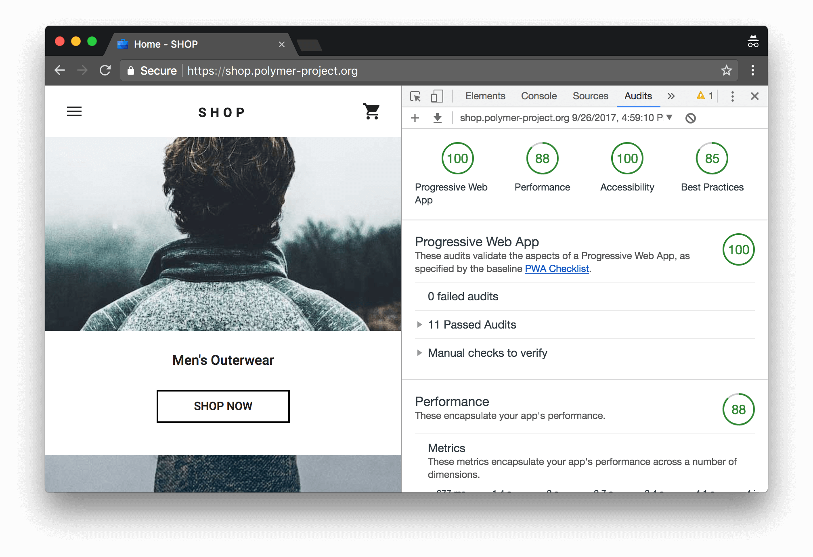
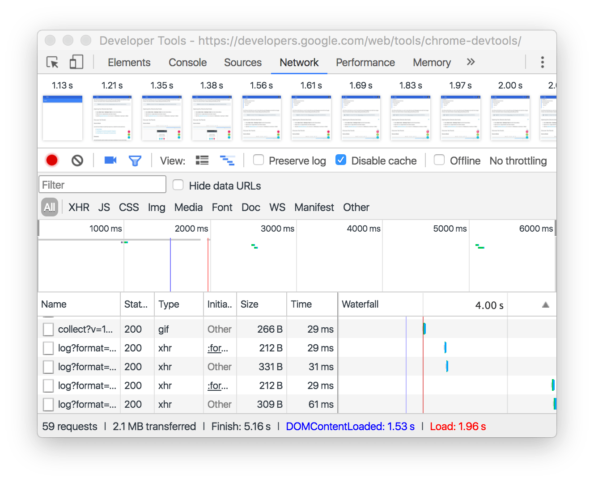
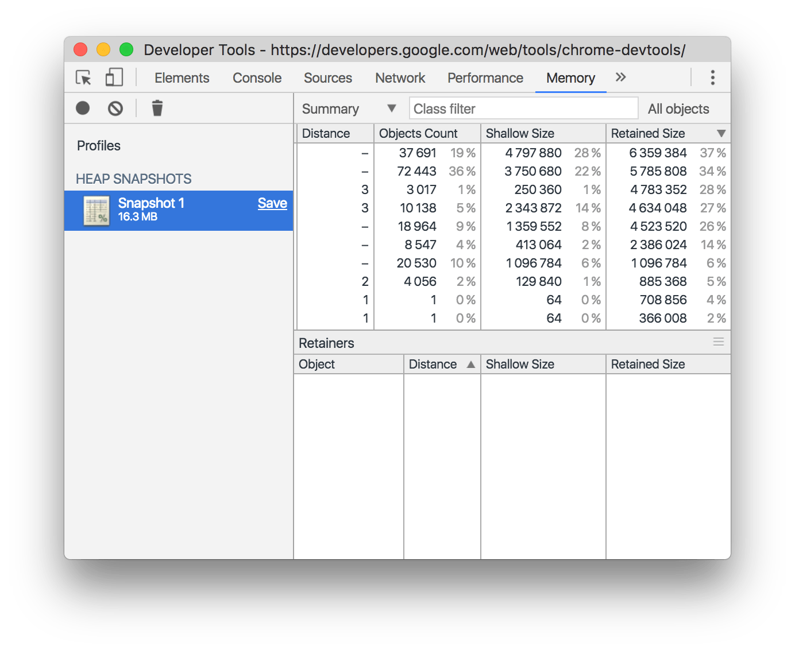
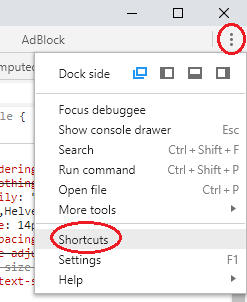

Navigation
==========

Load the developer tools by pressing `F12`. 

The developer tools are separated into eight tabs in addition to a settings dialog:
  * <b>Elements panel</b> - Inspect and manipulate the DOM tree and associated styles and event listeners.

  

  * <b>Console panel</b> - View messages and run JavaScript from the Console.

  

  * <b>Sources panel</b> - Examine, edit, and debug source code.

  

  * <b>Audits panel</b> - Identify and fix common problems that affect your site's performance, accessibillity and user experience.

  

  * <b>Network panel</b> - View and debug network activity.

  

  * <b>Performance panel</b> - Display and record activity as it runs, including events, script activity, page rendering, and memory usage.

  

  * <b>Memory panel</b> - Profile memory usage and track down leaks.

  

  * <b>Application panel</b> - Inspect all resources that are loaded, including IndexedDB or Web SQL databases, local and session storage, cookies, Application Cache, images, fonts, and stylesheets.

  

  * <b>Security panel</b> - Debug mixed content issues, certificate problems, and more.

  

Navigate between the separate tabs by pressing `ctr` + `[` and `ctr` + `]`

The Console is available at from any tab by pressing the `escape` key.

Explore more shortcuts:

  

  [More keyboard shortcuts](https://developers.google.com/chrome-developer-tools/docs/shortcuts)