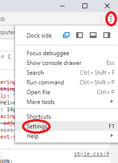

Settings
========
The settings dialog is available by pressing the <b>Main Menu</b> icon in the top right corner of the dev tools and then `settings` or with the keyboard shortcut `?` or `f1`.

[Full settings documentation](https://developers.google.com/chrome-developer-tools/docs/settings)

###Options to note
  * Disable cache (while DevTools is open)
  * Enable JavaScript and CSS source maps
  * Experiments - Will only appear if enabled [chrome://flags/#enable-devtools-experiments](chrome://flags/#enable-devtools-experiments)
    * Enable support for async stack traces
    * Enable frameworks debugging support
    * Show step-in candidates while debugging
    * Allow custom UI themes
    * Enable FlameChart mode in Timeline
  * Workspace