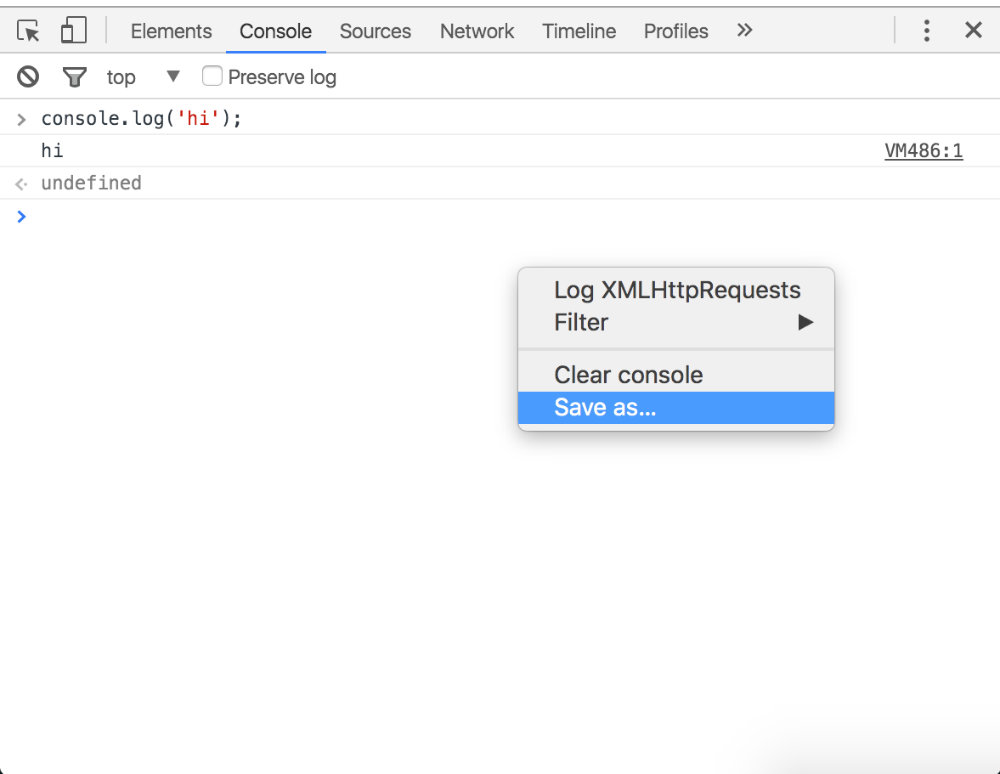

Console
=======

In addition to providing a convenient workspace for testing code, the console also provides a chrome specific API for inspecting and debugging applications. It is important to remember that the console is available from all other tabs by pressing the `Esc` key.

#### Working with the Console history

##### Clearing the history

You can clear the console history by doing any of the following:

* Right-click in the Console and press **Clear console**.
* Type `clear()` in the Console.
* Call `console.clear()` from within your JavaScript code.
* Type `Ctrl+L` (Mac, Windows, Linux).
* Click the "Clear console" button . 

##### Persisting the history
Enable the **Preserve log** checkbox at the top of the console to persist the console history between page refreshes or changes. Messages will be stored until you clear the Console or close the tab.

##### Saving the history

Right-click in the Console and select Save as to save the output of the console to a log file.

#### Selecting execution context

The dropdown menu highlighted in blue in the screenshot below is called the **Execution Context Selector**.

The Console defaults to the `top` context, unless you access DevTools by inspecting an element within another context. For example, if you inspect a `
` element within an `<iframe>`, then DevTools sets the Execution Context Selector to the context of that `<iframe>`.

#### Filtering the Console output

Click the **Filter** button () to filter console output. You can filter by severity level, by a regular expression, or by hiding network messages.

#### Additional settings

Open the DevTools settings, go to the **General **tab, and scroll down to the **Console **section for further Console settings.

####Exercise‎
Load the console and notice at the top frame the global variable `iFrameApp` is not defined. Switch the frame to iframe.html and it is defined.
<iframe src="../console/iframe.html"></iframe>
